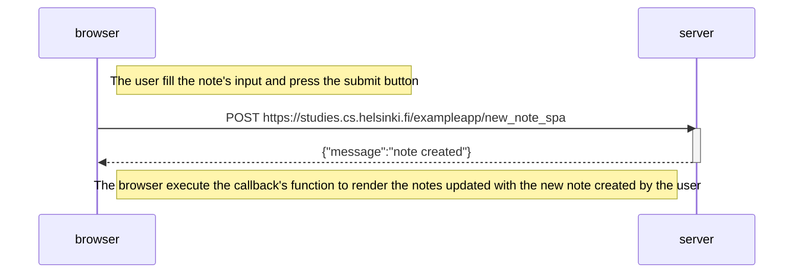

Exercise 0.4:

```mermaid
sequenceDiagram
    participant browser
    participant server

    Note right of browser: The user fill the note's input and press the submit button

    browser->>server: POST https://studies.cs.helsinki.fi/exampleapp/new_note_spa
    activate server
    server-->>browser: {"message":"note created"}
    deactivate server

    Note right of browser: The browser execute the callback's function to render the notes updated with the new note created by the user
```